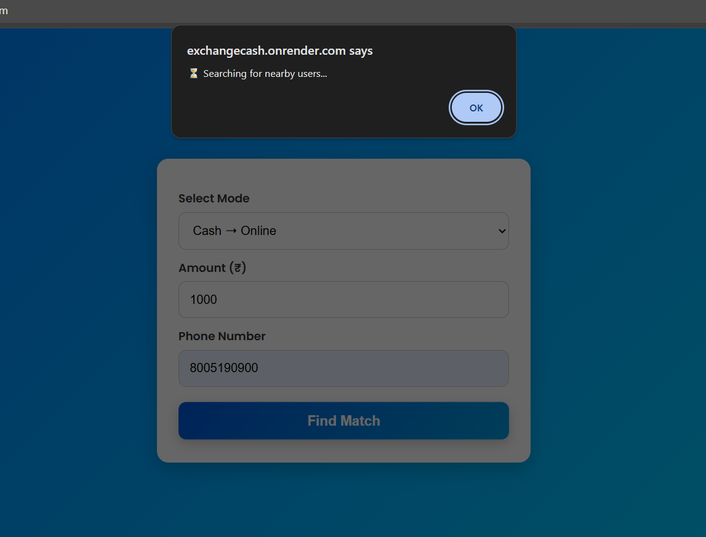
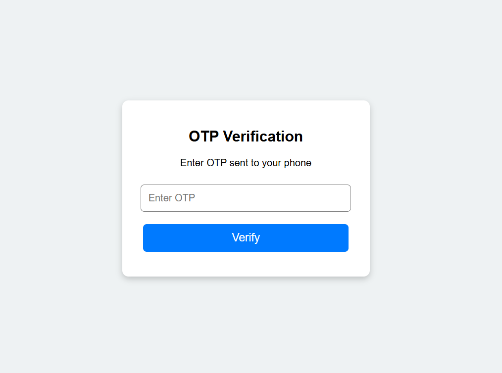
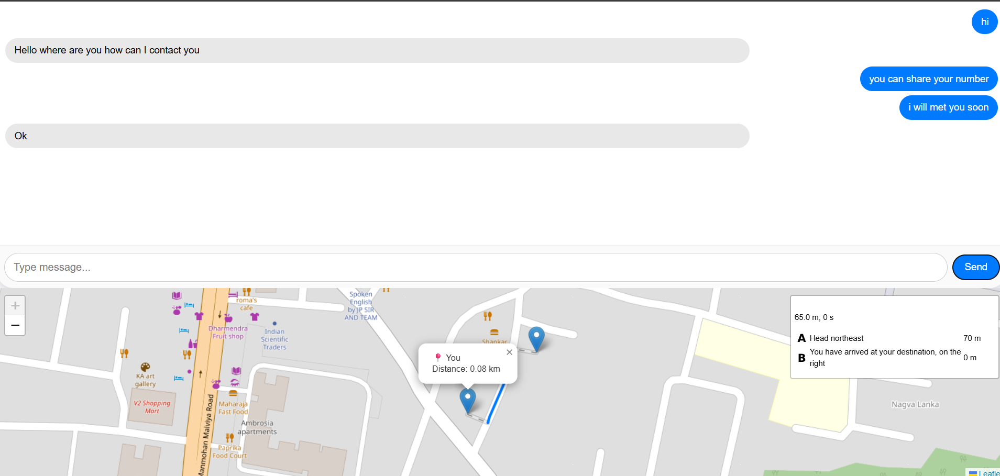

# CashConnect - Location Based Cash ↔ Online Exchange Platform

## Overview

CashConnect is a location-based matching platform that helps nearby users exchange cash and digital payments safely and efficiently.

For example:

* User A wants to give cash and receive an online payment.
* User B wants to transfer money online and receive cash.

The platform automatically finds nearby matching users and connects them through a real-time chat system.

---

## Problem Statement

Many people face situations where they need cash urgently but only have digital payment options available, or vice versa.

Finding a trustworthy nearby person for such exchanges is often difficult and time-consuming.

CashConnect aims to solve this problem by automatically matching nearby users with opposite requirements.

---

## Features

* Location-based user matching
* Real-time matching system
* MongoDB geospatial search
* OTP verification flow
* Real-time chat using Socket.IO
* Live location sharing
* Responsive user interface
* Match management system

---

## Tech Stack

### Frontend

* HTML
* CSS
* JavaScript
* EJS

### Backend

* Node.js
* Express.js

### Database

* MongoDB
* Mongoose

### Real-Time Communication

* Socket.IO

---

## How It Works

1. User submits a request.
2. System detects the user's location.
3. Platform searches for a nearby user with the opposite exchange requirement.
4. If a match is found:

   * A match record is created.
   * Users receive a real-time notification.
5. Users verify and enter a private chat room.
6. Users can communicate and share live location updates.

---

## Project Journey

### Before

* Basic prototype created during initial development.
* Limited documentation.
* Minimal user experience.
* Several unfinished features.
* Project was not polished for public use.

### After

* Revisited the project after several months.
* Added comprehensive documentation.
* Improved project presentation.
* Prepared the application for public showcase.
* Maintained a deployed working version.

---

## How GitHub Copilot Helped

GitHub Copilot assisted in:

* Refactoring backend code.
* Generating boilerplate code.
* Improving code readability.
* Speeding up debugging.
* Assisting with documentation.
* Accelerating development workflow.

---

## Future Improvements

* Real OTP verification
* User authentication
* Chat history storage
* User profiles
* Rating and trust system
* Fraud reporting features

---

## Screenshots

### Home Page

### Match Page

### Verification Page

### Chat Page

---

## Deployment

[Live Demo](https://exchangecash.onrender.com)

---

## Author

Ashish Yadav

Built as part of the GitHub Finish-Up Marathon Challenge.
